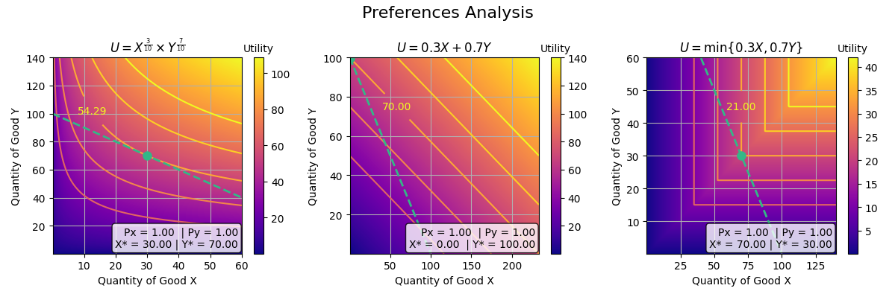

# econoclasses: Python economics analysis toolkit



## What is it?

**econoclasses** is a Python package for solving, analyzing and visualizing academic economics problems. It provides intuitive tools for working with utility functions, production technologies, market equilibrium, and welfare analysis. Useful for economics students and teachers.

## Features

- **Consumer theory**: Utility functions (Cobb-Douglas, CES, perfect substitutes/complements, quasilinear), Marshallian/Hicksian demand, Slutsky decomposition, elasticities
- **Production theory**: Production functions, cost minimization, firm supply
- **Market analysis**: Aggregate demand, market equilibrium
- **General equilibrium**: Exchange economies (Edgeworth box), Robinson Crusoe
- **Welfare**: Utility possibility frontier, social welfare functions
- **Visualization**: Indifference curves, isoquants, Edgeworth box, supply/demand, and more

## Installation

```bash
pip install econoclasses
```

Requires Python 3.12+.

## Quick examples

```python
from econoclasses import Utility, Consumer, Market, ProductionFunction, Firm

# Consumer theory
u = Utility('cobb-douglas', alpha=0.5, beta=0.5, income=100, price_x=2, price_y=3)
print(u.marshallian_demand)      # (25.0, 16.67)
print(u.slutsky_decomposition(new_price_x=1.5))

# Production theory
tech = ProductionFunction('cobb-douglas', alpha=0.3, A=2)
print(tech.cost_minimize(Q_target=100, wage=5, rental=10))

firm = Firm("Acme", tech, wage=5, rental=10)
print(firm.supply_at_price(15))

# Exchange economy
alice = Consumer("Alice", Utility('cobb-douglas', alpha=0.5, beta=0.5), income=0, endowment={'X': 10, 'Y': 2})
bob = Consumer("Bob", Utility('cobb-douglas', alpha=0.3, beta=0.7), income=0, endowment={'X': 2, 'Y': 10})

from econoclasses import ExchangeEconomy
economy = ExchangeEconomy(alice, bob)
print(economy.find_equilibrium())
print(economy.contract_curve())

# Robinson Crusoe
from econoclasses import RobinsonCrusoe
rc = RobinsonCrusoe(
    preferences=Utility('cobb-douglas', alpha=0.5, beta=0.5),
    technology=ProductionFunction('cobb-douglas', A=2, alpha=0.5, beta=0.5),
    total_time=24,
    capital=10
)
print(rc.find_equilibrium())

# Plotting
from econoclasses.plotting import (
    plot_indifference_curves,
    plot_edgeworth_box,
    plot_isoquants,
    plot_robinson_crusoe,
)

plot_indifference_curves(u, show_budget=True, show_optimal=True)
plot_edgeworth_box(economy, show_contract_curve=True)
plot_isoquants(tech, show_expansion_path=True)
plot_robinson_crusoe(rc)
```
## Next steps
- Game theory and oligopolies
- Comparative statics - Externalities, taxes and subsidies
- Dynamic convergences
- General equilibrium

## Contributing

Pull requests are welcome.
