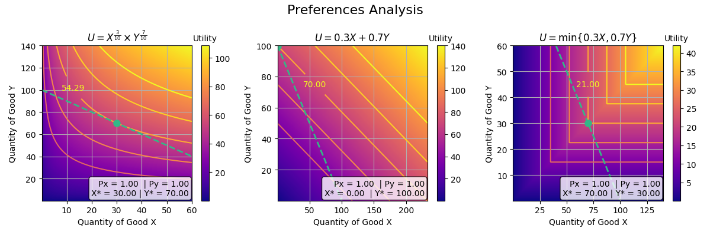

# econoclasses: Python economics analysis toolkit

## What is it?

**econoclasses** is a Python package designed to solve, analyze and visualize academic economics problems. It provides intuitive tools for working with utility functions, production curves, and economic optimization problems. It aims to be an useful tool for economics students and teachers, making complex economic concepts more accessible through computational methods.

##  Main features:
- Handling of utility functions
- Problem solving capabilities
- Secondary related calculations
- Visualization tools

## Proposed improvements:
- A production module that solves most used academic problems
- An equilibrium module that can handle individual supply and demand into aggregate versions
- In general, the proposed contents from structure.txt

## Contributing
- Pull requests are welcome.

## Quick Start
Try the example at examples folder!

